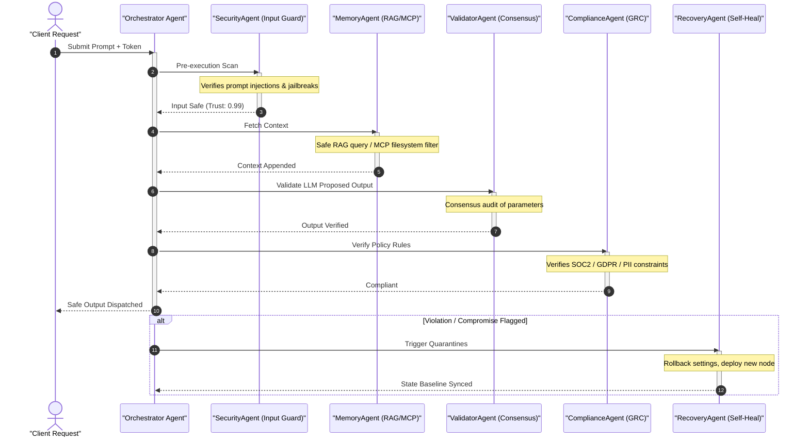

# 🌌 Sentinel Swarm AI

### _The Spatial Operating System for Autonomous Multi-Agent Intelligence_

[](https://github.com/rohan1252030019-netizen/sentinel-swarm-ai)


---
Sentinel Swarm AI is a spatial operating system designed for autonomous multi-agent security orchestration. It provides real-time threat detection, consensus-based validation, and self-healing recovery mechanisms for AI agent networks.

## Core Features

- **3D Swarm Visualization**: Interactive canvas displaying agent network topology and real-time status.
- **6-Layer Consensus Pipeline**: A structured defense mechanism (Planner → Security → Memory → Validator → Compliance → Recovery).
- **Spotlight Command Center**: Natural language interface for seamless system control.
- **Attack Simulation Engine**: Automated compromise chain testing with visual walkthroughs.
- **Executive Dashboard**: Persona-based views tailored for CEOs, CISOs, Operations, and Investors.
- **Digital Immune System**: Self-learning threat signature rules.
- **Black Box Forensics**: Step-by-step replay capabilities for agent decision chains.
- **Self-Healing Recovery**: Automated state rollback upon compromise detection.
## 🔮 Spatial Interface Overview

Sentinel Swarm AI prioritizes immersive spatial interaction over traditional metric widgets:

```
+-----------------------------------------------------------------------+
|  [Status: Active]                                   [RBAC Override]   |
|                                                                       |
|                       *   CivilianAgent_0x82a                         |
|           PlannerAgent                                                |
|                *               LLM Engine                             |
|                                    *                                  |
|         * SecurityAgent                          * ValidatorAgent     |
|                                                                       |
|                                  * RecoveryAgent                      |
|                                                                       |
|                                                                       |
|                                                                       |
|                [ Swarm ] [ Cmd ] [ GRC ] [ Video ] [ Policy ]         |
+-----------------------------------------------------------------------+
```

*   **Swarm Space**: Drag and orbit the 3D-like glowing agent civilization particle swarm. Hover and click nodes to view floating glass telemetry cards.
*   **Command Bar**: Press `Cmd+K` to search anything. Shortcut pills trigger immediate compromise simulations or reputation health audits.
*   **Executive boards**: Flip to the GRC Storyboard to view financial and compliance metrics displayed in clean typography.

---

## 🏗️ Consensus Architecture Diagram

The diagram below details the sequence of transactions passing through the 6-layer Consensus Validation Pipeline:



---


## Getting Started

### Prerequisites

- Node.js v20 or higher
- npm

### Installation

1. Clone the repository:
   ```bash
   git clone https://github.com/rohan1252030019-netizen/sentinel-swarm-ai.git
   cd sentinel-swarm-ai
   ```

2. Install dependencies:
   ```bash
   npm run install:all
   ```

### Configuration

Set up your environment variables.

**Backend** (`backend/.env`):
```env
PORT=5000
AZURE_OPENAI_ENDPOINT="https://your-resource.openai.azure.com/"
AZURE_OPENAI_KEY="your-azure-key"
```

**Frontend** (`frontend/.env`):
```env
VITE_API_URL="http://localhost:5000"
VITE_WS_URL="ws://localhost:5000"
```

### Running Locally

Start both the frontend and backend servers concurrently:

```bash
npm run dev
```

The application will be accessible at [http://localhost:3000](http://localhost:3000).

## Deployment

To deploy the application using Docker:

```bash
docker-compose -f docker/docker-compose.yml up --build -d
```
- Frontend: `http://localhost:80`
- Backend: `http://localhost:5000`

## License

This project is licensed under the MIT License - see the [LICENSE](LICENSE) file for details.
